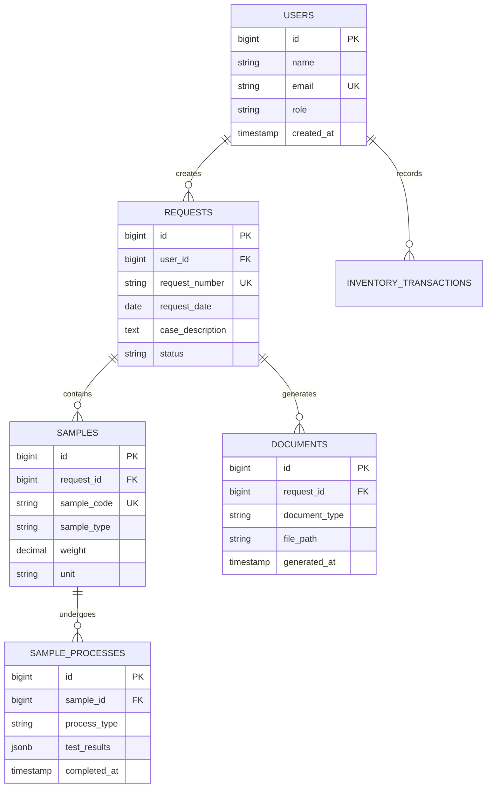

# WALKTHROUGH - LPMF LIMS v1.1.6

> **Laboratory Information Management System untuk Laboratorium Pengujian Mutu Farmasi**

---

## 📋 Table of Contents

- [🚀 Quick Links](#-quick-links)
- [📰 Recent Changes](#-recent-changes-v11x)
- [📖 Project Overview](#-project-overview)
- [📚 Product Documentation](#-product-documentation)
- [📜 Changelog Archive](#-changelog-archive)

---

## 🚀 Quick Links

| Resource                                                         | Description                             |
| ---------------------------------------------------------------- | --------------------------------------- |
| [AGENTS.md](./AGENTS.md)                                         | Workflow rules & agent delegation guide |
| [UI-UX-IMPROVEMENT-PLAN.md](./UI-UX-IMPROVEMENT-PLAN.md)         | UI/UX improvement roadmap               |
| [PARTY_MODE_SESSION_EXAMPLE.md](./PARTY_MODE_SESSION_EXAMPLE.md) | Multi-agent collaboration examples      |
| [report/README.md](./report/README.md)                           | Frontend audit system guide             |
| [patcher/](./patcher/)                                           | Deployment & design documentation       |

**Current Version:** v1.1.6 (10 Januari 2026)  
**Latest Feature:** Semantic versioning constraint applied

---

## 📰 Recent Changes (v1.1.x)

### v1.1.6 (10 Januari 2026) - Semantic Versioning Constraint

**📌 What Changed:**

- Applied strict version numbering rule: max 9 per segment (MAJOR.MINOR.PATCH)
- When reaching 10, increment next higher segment instead
- Example: `1.0.9` → `1.1.0` (not `1.0.10`)

**✅ Impact:**

- Cleaner version history
- Prevents version overflow
- Standardized across all docs

**📦 Files:** `AGENTS.md`, `WALKTHROUGH.md`, `todos.md`

---

### v1.1.5 (10 Januari 2026) - UI/UX Phase 4: Form Stepper Integration

**📌 What Changed:**

- Integrated form stepper into `requests/create.blade.php` (1166 lines)
- Added 5 tracked sections with scroll-based progress indicator
- Mobile responsive with auto-highlighting

**✅ Features:**

- Sticky progress bar at top
- Click-to-jump navigation
- Auto-tracking scroll position
- Labels hide on mobile (<768px)

**📦 Files:** `resources/views/requests/create.blade.php`

**🧪 Testing:**

```bash
# Access form
Visit: /requests/create

# Test scroll tracking
1. Scroll through form → active step should update
2. Click step 3 → should jump to "Tersangka" section
3. Test on mobile (375px width) → labels should hide
```

---

### v1.1.4 (10 Januari 2026) - UI/UX Phase 3: Confirm Dialog Deployment

**📌 What Changed:**

- Replaced **all 14** native `confirm()` calls with custom `showConfirmDialog()`
- Created reusable `<x-form-field>` component with auto-validation

**✅ 100% Coverage:**

- ✓ User management (5 instances)
- ✓ Sample processing (2 instances)
- ✓ Requests (1 instance)
- ✓ Delivery & Labels (3 instances)
- ✓ Settings (4 instances)
- ✓ Inventory (1 instance)

**📦 Benefits:**

- Consistent UX across all confirmations
- Async/Promise support
- Loading states
- Keyboard navigation (Escape, Tab)
- ARIA attributes for accessibility

---

### v1.1.3 (10 Januari 2026) - UI/UX Phase 2: Component Creation

**📌 What Changed:**

- Created `<x-form-stepper>` component - Visual progress for multi-step forms
- Created `<x-confirm-dialog>` component - Custom confirmation modals
- Enhanced `<x-dropdown>` with ARIA attributes

**✅ Components:**

1. **Form Stepper** (`form-stepper.blade.php`)
    - Sticky top navigation
    - Auto-tracking via Intersection Observer API
    - Click-to-scroll with smooth behavior
    - Mobile responsive

2. **Confirm Dialog** (`confirm-dialog.blade.php`)
    - 3 types: danger (red), warning (yellow), info (blue)
    - Async support with loading states
    - Customizable button text

3. **Dropdown Accessibility** (`dropdown.blade.php`)
    - Added `aria-haspopup`, `aria-expanded`, `role="menu"`
    - Keyboard navigation (Escape, Tab)

**📦 Usage:**

```php
// Form Stepper
<x-form-stepper :steps="[
    ['id' => 'step-1', 'label' => 'Section 1'],
    ['id' => 'step-2', 'label' => 'Section 2']
]" />

// Confirm Dialog
showConfirmDialog({
    type: 'danger',
    title: 'Delete Item',
    message: 'Are you sure?',
    onConfirm: async () => { /* action */ }
});
```

---

### v1.1.2 (10 Januari 2026) - UI/UX Phase 1: Critical Fixes

**📌 What Changed:**

- Fixed breadcrumb navigation (2 pages) - Changed `'url'` to `'href'`
- Fixed mobile table scrolling (2 pages) - `overflow-hidden` → `overflow-x-auto`

**✅ Issues Fixed:**

1. **🔴 CRITICAL: Breadcrumb Links Broken**
    - Files: `search/index.blade.php`, `monitoring/environment/manage.blade.php`
    - Root cause: Component expected `href` but views used `url` key

2. **🔴 CRITICAL: Tables Not Responsive**
    - Files: `delivery/index.blade.php`, `sample-processes/index.blade.php`
    - Root cause: `overflow-hidden` clipped content on mobile

**📦 Testing:**

```bash
# Breadcrumbs
Visit: /search → Click "Home" link → Should navigate

# Mobile tables
Visit: /delivery → Resize to 375px → Table should scroll horizontally
```

---

### v1.1.1 (10 Januari 2026) - Party Mode: Multi-Agent Collaboration

**📌 What Changed:**

- Implemented Party Mode workflow for complex tasks
- Documented multi-agent orchestration patterns
- Created agent selection matrix

**✅ Core Principles:**

1. **Parallel Agent Orchestration** - Launch 2-4 specialized agents simultaneously
2. **Domain Expertise** - Each agent focuses on their specialization
3. **Cross-Pollination** - Agents' findings inform each other
4. **Exhaustive Search** - Never stop at first result

**📦 Agent Roles:**
| Agent | Specialization | When to Use |
|-------|----------------|-------------|
| `explore` | Codebase exploration | Finding implementations, patterns |
| `librarian` | External docs, APIs | Researching frameworks, libraries |
| `oracle` | Problem-solving, strategy | Complex decisions, after failures |
| `frontend-ui-ux-engineer` | UI/UX design | Creating interfaces, accessibility |
| `document-writer` | Technical writing | Documentation, summaries |

**📦 Workflow Pattern:**

```
1. ANALYZE → Launch 2-4 background agents (explore + librarian)
2. SYNTHESIZE → Combine findings from all agents
3. CONSULT → oracle for complex decisions
4. IMPLEMENT → Use specialist agents (Sisyphus, frontend-ui-ux-engineer)
5. DOCUMENT → document-writer updates WALKTHROUGH.md
6. REVIEW → oracle validates implementation
```

**📊 Performance:** 60-70% time savings through parallel execution

**📖 Full Guide:** See [PARTY_MODE_SESSION_EXAMPLE.md](./PARTY_MODE_SESSION_EXAMPLE.md)

---

### v1.1.0 (10 Januari 2026) - WhatsApp Bugfix & Editable Templates

**📌 What Changed:**

- Fixed 4 critical WhatsApp notification bugs
- Added editable message templates UI in settings

**✅ Bugs Fixed:**

1. **API Parameter Mismatch** - `jid` → `phone` parameter
2. **Database Constraint Violation** - Removed invalid `'sending'` status
3. **DNS Resolution Issue** - `gowa.lpmf.local` → `localhost:3000`
4. **Message ID Extraction** - Fixed response parsing

**✅ New Feature: Editable Templates**

- UI section in WhatsApp settings
- Customizable templates per milestone
- `{resi}` placeholder support
- Override system with default fallback

**📦 Testing:**

- Successfully sent 5 messages to +6285956592404
- All delivered with provider message IDs
- Queue retry with exponential backoff working

---

## 📖 Project Overview

### Tech Stack

| Layer          | Technology                        | Version                      |
| -------------- | --------------------------------- | ---------------------------- |
| Backend        | Laravel (PHP)                     | 12.x (PHP 8.3+)              |
| Frontend       | Blade + Alpine.js + Tailwind CSS  | Alpine 3.x, Tailwind 3.x     |
| Database       | PostgreSQL                        | 16+                          |
| Build Tool     | Vite                              | 7.x                          |
| PDF Generation | DomPDF                            | barryvdh/laravel-dompdf ^3.1 |
| Queue          | Laravel Queue                     | Database driver              |
| Audit Tools    | Puppeteer + Lighthouse + axe-core | Development only             |

### Quick Start

```bash
# Install dependencies
composer install && npm install

# Development server (required for audits)
php artisan serve

# Build frontend
npm run build

# Run all audits
npm run audit:all

# Run critical audits (CI, pre-commit)
npm run audit:critical

# Run tests
npm run test
```

### Architecture Overview

```
┌─────────────────────────────────────────────────────────────┐
│                        LPMF LIMS                            │
├─────────────────────────────────────────────────────────────┤
│  ┌─────────────┐  ┌─────────────┐  ┌─────────────┐         │
│  │   Request   │  │   Sample    │  │  Inventory  │         │
│  │ Management  │  │  Processing │  │ Management  │         │
│  └─────────────┘  └─────────────┘  └─────────────┘         │
│                                                              │
│  ┌─────────────┐  ┌─────────────┐  ┌─────────────┐         │
│  │  Document   │  │   Delivery  │  │   Reports   │         │
│  │ Generation  │  │   Tracking  │  │  Analytics  │         │
│  └─────────────┘  └─────────────┘  └─────────────┘         │
├─────────────────────────────────────────────────────────────┤
│            Laravel 12 Backend (PostgreSQL)                  │
│         Queue System | File Storage | Authentication        │
└─────────────────────────────────────────────────────────────┘
```

### Key Features

- **Request Management** - Permohonan pengujian dari penyidik kepolisian
- **Sample Processing** - Tracking barang bukti (narkotika, zat terlarang)
- **Document Generation** - Berita Acara, Laporan Hasil Uji (PDF)
- **Inventory Management** - Reagen, consumables, stock tracking
- **Analytics Dashboard** - KPI monitoring, performance metrics
- **WhatsApp Notifications** - Automated milestone notifications
- **User Management** - Role-based access control (Admin, Analyst, Viewer)

---

## 📚 Product Documentation

### 📋 Daftar Isi

1. [Ringkasan Produk](#ringkasan-produk)
2. [Arsitektur Sistem](#arsitektur-sistem-detail)
3. [Entity Relationship Diagram (ERD)](#entity-relationship-diagram-erd)
4. [Modul & Fitur](#modul--fitur)
5. [Alur Kerja (Workflow)](#alur-kerja-workflow)
6. [API Endpoints](#api-endpoints)
7. [Konfigurasi & Deployment](#konfigurasi--deployment)
8. [Panduan Pengembangan](#panduan-pengembangan)

---

### Ringkasan Produk

**Tujuan:**

LPMF LIMS adalah sistem manajemen informasi laboratorium yang dirancang untuk:

- Mengelola **permohonan pengujian** dari penyidik kepolisian
- Melacak **sampel barang bukti** (narkotika dan zat terlarang)
- Menghasilkan **dokumen resmi** (Berita Acara, Laporan Hasil Uji)
- Mengelola **inventaris laboratorium** (reagen, consumables)
- Menyediakan **dashboard analitik** untuk monitoring kinerja

**User Roles:**

| Role    | Permissions                                 | Typical Users         |
| ------- | ------------------------------------------- | --------------------- |
| Admin   | Full access, user management, system config | Lab manager, IT staff |
| Analyst | Create/edit samples, generate reports       | Lab technicians       |
| Viewer  | Read-only access                            | Supervisors, auditors |

---

### Arsitektur Sistem (Detail)

```
┌───────────────────────────────────────────────────────────────────┐
│                         Frontend Layer                            │
│     Blade Templates + Alpine.js + Tailwind CSS + Vite            │
├───────────────────────────────────────────────────────────────────┤
│                         Backend Layer                             │
│  ┌──────────────┐  ┌──────────────┐  ┌──────────────┐           │
│  │ Controllers  │  │   Services   │  │ Repositories │           │
│  │              │  │              │  │              │           │
│  │ - Request    │  │ - Document   │  │ - Eloquent   │           │
│  │ - Sample     │  │ - PDF Gen    │  │ - Query      │           │
│  │ - Inventory  │  │ - WhatsApp   │  │ - Cache      │           │
│  └──────────────┘  └──────────────┘  └──────────────┘           │
├───────────────────────────────────────────────────────────────────┤
│                         Data Layer                                │
│  ┌──────────────┐  ┌──────────────┐  ┌──────────────┐           │
│  │  PostgreSQL  │  │    Queue     │  │ File Storage │           │
│  │   Database   │  │ (Database)   │  │   (Local)    │           │
│  └──────────────┘  └──────────────┘  └──────────────┘           │
├───────────────────────────────────────────────────────────────────┤
│                    External Integrations                          │
│  ┌──────────────┐  ┌──────────────┐                              │
│  │   WhatsApp   │  │   DomPDF     │                              │
│  │ (go-whatsapp)│  │ (PDF Engine) │                              │
│  └──────────────┘  └──────────────┘                              │
└───────────────────────────────────────────────────────────────────┘
```

**Design Patterns:**

- **Repository Pattern** - Data access abstraction
- **Service Layer** - Business logic separation
- **Observer Pattern** - Model events for notifications
- **Factory Pattern** - Document generation
- **Strategy Pattern** - PDF template selection

---

### Entity Relationship Diagram (ERD)

**Core Entities:**



**Supporting Tables:**

- `settings` - System configuration (key-value store)
- `inventory_items` - Lab supplies, reagents
- `inventory_transactions` - Stock movements
- `whatsapp_outbox` - Notification queue
- `jobs` - Laravel queue jobs
- `failed_jobs` - Failed queue jobs

---

### Modul & Fitur

#### 1. Request Management

**Path:** `/requests`

**Features:**

- Create new test requests
- Upload supporting documents
- Add suspects information
- Track request status (Draft → In Progress → Completed)
- Search & filter requests

**Key Files:**

- `app/Http/Controllers/RequestController.php`
- `app/Models/Request.php`
- `resources/views/requests/`

---

#### 2. Sample Processing

**Path:** `/sample-processes`

**Features:**

- Record sample reception
- Conduct tests (narkotika, psikotropika)
- Record test results (JSON format)
- Generate analysis reports
- Mark samples ready for delivery

**Key Files:**

- `app/Http/Controllers/SampleProcessController.php`
- `app/Models/SampleProcess.php`
- `resources/views/sample-processes/`

---

#### 3. Document Generation

**Path:** `/documents`

**Features:**

- Generate Berita Acara (Evidence Report)
- Generate Laporan Hasil Uji (Test Report)
- Editable Blade templates
- PDF export with DomPDF
- Version control for templates

**Key Files:**

- `app/Services/DocumentGenerationService.php`
- `app/Http/Controllers/DocumentController.php`
- `resources/views/templates/blade/`

---

#### 4. Inventory Management

**Path:** `/inventory/items`

**Features:**

- Track reagents & consumables
- Record stock in/out transactions
- Low stock alerts
- Expiry date tracking
- Usage history

**Key Files:**

- `app/Http/Controllers/Inventory/ItemController.php`
- `app/Models/InventoryItem.php`
- `resources/views/inventory/`

---

#### 5. WhatsApp Notifications

**Path:** `/settings` (WhatsApp section)

**Features:**

- Milestone-based notifications
- Customizable message templates
- Queue-based sending with retry
- Health check for GOWA service
- Test message functionality

**Key Files:**

- `app/Services/WhatsApp/NotificationService.php`
- `app/Services/WhatsApp/GowaClient.php`
- `app/Jobs/SendWhatsAppNotificationJob.php`

**Integration:** go-whatsapp-web-multidevice API

---

### Alur Kerja (Workflow)

#### Standard Test Request Flow

```
1. Penyidik → Create Request
   ↓
2. Upload Documents (Surat Permintaan, BA, etc.)
   ↓
3. Add Suspects & Sample Details
   ↓
4. Submit Request
   ↓
5. Lab Analyst → Receive Samples
   ↓
6. Conduct Tests → Record Results
   ↓
7. Generate Reports (BA + LHU)
   ↓
8. Mark Ready for Delivery
   ↓
9. Delivery → Hand over to Penyidik
   ↓
10. Complete Request
```

**WhatsApp Notifications Sent:**

- Sample received
- Test started
- Test completed
- Ready for delivery
- Delivered

---

### API Endpoints

**Authentication:**

```
POST   /login                  # User login
POST   /logout                 # User logout
GET    /user                   # Get current user
```

**Requests:**

```
GET    /requests               # List all requests
POST   /requests               # Create new request
GET    /requests/{id}          # Get request details
PUT    /requests/{id}          # Update request
DELETE /requests/{id}          # Delete request
```

**Samples:**

```
GET    /sample-processes       # List all samples
POST   /sample-processes       # Create new sample process
GET    /sample-processes/{id}  # Get sample details
PUT    /sample-processes/{id}  # Update sample
DELETE /sample-processes/{id}  # Delete sample
```

**Documents:**

```
POST   /documents/generate     # Generate document (BA/LHU)
GET    /documents/{id}         # Download document PDF
```

**Settings:**

```
GET    /api/settings           # Get all settings
PUT    /api/settings           # Update settings
POST   /api/settings/whatsapp/test  # Test WhatsApp message
GET    /api/settings/whatsapp/health # Check GOWA health
```

**Inventory:**

```
GET    /inventory/items        # List inventory items
POST   /inventory/items        # Add new item
PUT    /inventory/items/{id}   # Update item
DELETE /inventory/items/{id}   # Delete item
POST   /inventory/transactions # Record transaction
```

---

### Konfigurasi & Deployment

#### Environment Variables

```bash
# App
APP_NAME="LPMF LIMS"
APP_ENV=production
APP_DEBUG=false
APP_URL=https://lpmf.example.com

# Database
DB_CONNECTION=pgsql
DB_HOST=127.0.0.1
DB_PORT=5432
DB_DATABASE=lpmf_lims
DB_USERNAME=lpmf_user
DB_PASSWORD=secure_password

# Queue
QUEUE_CONNECTION=database

# WhatsApp (GOWA)
WHATSAPP_BASE_URL=http://localhost:3000
WHATSAPP_ENABLED=true

# Storage
FILESYSTEM_DISK=local
```

#### Production Setup

```bash
# 1. Clone repository
git clone https://github.com/your-org/lpmf-lims.git
cd lpmf-lims

# 2. Install dependencies
composer install --no-dev --optimize-autoloader
npm install && npm run build

# 3. Setup environment
cp .env.example .env
php artisan key:generate

# 4. Run migrations
php artisan migrate --force

# 5. Seed default settings
php artisan db:seed --class=SettingsSeeder

# 6. Setup queue worker
php artisan queue:work --daemon

# 7. Setup web server (Nginx/Apache)
# Point document root to /public
```

#### Audit System

```bash
# Run all audits before deploy
npm run audit:critical

# Individual audits
npm run audit:css        # CSS linting
npm run audit:js         # JS linting
npm run audit:a11y       # Accessibility (requires server running)
npm run audit:guard      # Safe Mode v2 validation
```

**CI/CD Integration:**

Add to GitHub Actions:

```yaml
- name: Run critical audits
  run: npm run audit:critical
```

See [report/README.md](./report/README.md) for full guide.

---

### Panduan Pengembangan

#### Code Style

**PHP (PSR-12):**

```php
// ✅ Good
public function processRequest(Request $request): JsonResponse
{
    $validated = $request->validate([
        'name' => 'required|string|max:255',
    ]);

    return response()->json(['success' => true]);
}

// ❌ Bad
public function processRequest(Request $request) {
    $validated=$request->validate(['name'=>'required|string|max:255']);
    return response()->json(['success'=>true]);
}
```

**JavaScript (ESLint):**

```javascript
// ✅ Good
async function fetchData() {
    const response = await fetch("/api/data");
    return response.json();
}

// ❌ Bad
async function fetchData() {
    const response = await fetch("/api/data");
    return response.json();
}
```

**CSS (Stylelint + Safe Mode v2):**

```css
/* ✅ Good - Base styles */
.container {
    width: 100%;
    max-width: 1280px;
    margin: 0 auto;
}

/* ✅ Good - Overlay styles (pd-*.css) - NO LAYOUT PROPERTIES */
.pd-custom-color {
    color: #3b82f6;
    background-color: #eff6ff;
}

/* ❌ Bad - Overlay with layout (will fail audit:guard) */
.pd-custom-spacing {
    margin: 1rem; /* ❌ Layout property in overlay */
}
```

#### Testing

```bash
# Run PHP tests
php artisan test

# Run specific test
php artisan test --filter RequestTest

# Run with coverage
php artisan test --coverage

# Run JS tests
npm run test

# Run specific test file
npm run test -- settings-whatsapp.test.js
```

#### Database Migrations

```bash
# Create migration
php artisan make:migration create_table_name

# Run migrations
php artisan migrate

# Rollback last batch
php artisan migrate:rollback

# Rollback all & re-run
php artisan migrate:fresh
```

#### Adding New Features

1. **Plan** → Update `AGENTS.md` todos
2. **Implement** → Follow existing patterns
3. **Test** → Write tests, run audits
4. **Document** → Update WALKTHROUGH.md
5. **Commit** → Descriptive commit messages
6. **PR** → Create pull request

**Git Commit Convention:**

```
feat: add WhatsApp notification system
fix: resolve breadcrumb navigation issue
docs: update WALKTHROUGH.md with v1.1.5
refactor: extract document service class
test: add sample process tests
chore: update dependencies
```

---

## 📜 Changelog Archive

<details>
<summary><strong>v1.0.9 (9 Januari 2026) - WhatsApp Notification System</strong></summary>

**Feature:** Automated WhatsApp notifications for test request milestones

**Implementation:**

- Automatic notifications when samples reach specific milestones
- Configurable milestone selection
- Queue-based sending with retry (max 5 attempts, exponential backoff)
- Message outbox tracking with audit trail
- Health check endpoint for GOWA service
- Test message functionality
- Phone number normalization (Indonesia E.164)

**Files:**

- `app/Services/WhatsApp/NotificationService.php` (NEW)
- `app/Services/WhatsApp/GowaClient.php` (NEW)
- `app/Jobs/SendWhatsAppNotificationJob.php` (NEW)
- `database/migrations/*_create_whatsapp_outbox_table.php` (NEW)

**Tech Stack:**

- go-whatsapp-web-multidevice API
- Laravel Queue (database driver)
- PostgreSQL for outbox storage

</details>

<details>
<summary><strong>v1.0.8 (8 Januari 2026) - Document Template System</strong></summary>

**Feature:** Editable Blade templates for document generation

**Implementation:**

- Inline Blade editor in settings
- Version control with backup/restore
- Template preview functionality
- Validation for Blade syntax
- Support for custom variables

**Templates:**

- Berita Acara (BA)
- Laporan Hasil Uji (LHU)
- Delivery Receipt

**Files:**

- `app/Http/Controllers/Settings/TemplateController.php` (NEW)
- `resources/views/settings/blade-templates.blade.php` (NEW)

</details>

<details>
<summary><strong>v1.0.7 (8 Januari 2026) - Inventory Management</strong></summary>

**Feature:** Lab inventory tracking system

**Implementation:**

- Item catalog (reagents, consumables)
- Stock in/out transactions
- Low stock alerts
- Expiry date tracking
- Usage history reports

**Files:**

- `app/Http/Controllers/Inventory/ItemController.php` (NEW)
- `app/Models/InventoryItem.php` (NEW)
- `app/Models/InventoryTransaction.php` (NEW)

</details>

<details>
<summary><strong>v1.0.6 (7 Januari 2026) - Delivery Tracking</strong></summary>

**Feature:** Sample delivery management

**Implementation:**

- Delivery scheduling
- Recipient confirmation
- Label generation
- Tracking number assignment
- Proof of delivery upload

**Files:**

- `app/Http/Controllers/DeliveryController.php` (NEW)
- `resources/views/delivery/` (NEW)

</details>

<details>
<summary><strong>v1.0.5 (5 Januari 2026) - Sample Processing</strong></summary>

**Feature:** Lab test result recording

**Implementation:**

- Test type selection (narkotika, psikotropika)
- JSON result storage
- Multi-step process tracking
- Result validation
- Quality control flags

**Files:**

- `app/Http/Controllers/SampleProcessController.php` (NEW)
- `app/Models/SampleProcess.php` (NEW)

</details>

<details>
<summary><strong>v1.0.4 (3 Januari 2026) - Document Generation</strong></summary>

**Feature:** PDF report generation with DomPDF

**Implementation:**

- Berita Acara template
- Laporan Hasil Uji template
- Dynamic data binding
- QR code support
- Digital signature placeholders

**Files:**

- `app/Services/DocumentGenerationService.php` (NEW)
- `resources/views/templates/pdf/` (NEW)

</details>

<details>
<summary><strong>v1.0.3 (3 Januari 2026) - Request Management</strong></summary>

**Feature:** Test request creation and tracking

**Implementation:**

- Multi-step form (investigator, letter, suspects, documents, samples)
- File upload support
- Request status workflow
- Search and filtering
- Bulk actions

**Files:**

- `app/Http/Controllers/RequestController.php` (NEW)
- `app/Models/Request.php` (NEW)
- `resources/views/requests/` (NEW)

</details>

<details>
<summary><strong>v1.0.2 (2 Januari 2026) - User Management</strong></summary>

**Feature:** User authentication and authorization

**Implementation:**

- Role-based access control (Admin, Analyst, Viewer)
- User CRUD operations
- Password reset
- Activity logging
- Session management

**Files:**

- `app/Http/Controllers/UserController.php` (NEW)
- `app/Models/User.php` (UPDATED)
- `database/seeders/RoleSeeder.php` (NEW)

</details>

<details>
<summary><strong>v1.0.1 (31 Desember 2025) - Initial Setup</strong></summary>

**Feature:** Project foundation

**Implementation:**

- Laravel 12 installation
- PostgreSQL database setup
- Tailwind CSS + Alpine.js integration
- Vite build configuration
- Base layout and navigation
- Authentication scaffolding

**Tech Stack:**

- Laravel 12 (PHP 8.3)
- PostgreSQL 16
- Alpine.js 3.x
- Tailwind CSS 3.x
- Vite 7.x

</details>

---

## 📊 Sistem IKU (Indeks Kinerja Utama)

### Dashboard Metrics

**Request Metrics:**

- Total requests (monthly/yearly)
- Average completion time
- Request status distribution
- Peak request periods

**Sample Metrics:**

- Total samples processed
- Test type distribution
- Average processing time per test type
- Quality control pass rate

**Inventory Metrics:**

- Stock levels by category
- Low stock items count
- Expiry alerts
- Usage trends

**Delivery Metrics:**

- On-time delivery rate
- Average delivery time
- Pending deliveries

**System Metrics:**

- Active users
- Document generation count
- WhatsApp notification success rate
- Queue job success rate

---

## Storage Cleanup

### Automated Cleanup Tasks

**Schedule:** Daily at 2:00 AM

**Cleanup Targets:**

1. **Temporary Files** (older than 24 hours)
    - `storage/app/temp/*`
    - `storage/framework/cache/*`

2. **Generated PDFs** (older than 30 days)
    - `storage/app/documents/*.pdf`
    - Keep if linked to active requests

3. **Failed Job Logs** (older than 7 days)
    - `failed_jobs` table
    - Archive to JSON before deletion

4. **WhatsApp Outbox** (older than 90 days)
    - `whatsapp_outbox` table
    - Keep `sent` and `delivered` status only

**Manual Cleanup:**

```bash
# Run cleanup command
php artisan storage:cleanup

# With options
php artisan storage:cleanup --days=30 --dry-run
```

---

## ⚠️ Aturan Dokumentasi

**PENTING:** WALKTHROUGH.md adalah **single source of truth** untuk dokumentasi project.

**Aturan:**

1. ❌ **JANGAN** buat file `.md` baru untuk dokumentasi
2. ✅ **UPDATE** WALKTHROUGH.md di section yang relevan
3. ✅ **GUNAKAN** heading hierarchy yang proper
4. ✅ **TAMBAHKAN** date stamp: `Updated on YYYY-MM-DD`

**File Exception (diperbolehkan terpisah):**

- `README.md` (root, untuk GitHub)
- `PRE_PULL_CHECKLIST.md`
- `PRE_PUSH_CHECKLIST.md`
- `report/README.md`
- `.github/copilot-instructions.md`
- `AGENTS.md`
- `UI-UX-IMPROVEMENT-PLAN.md`
- `PARTY_MODE_SESSION_EXAMPLE.md`

**Versioning Rules:**

- Format: `MAJOR.MINOR.PATCH`
- **MAX 9 per segment** (enforced)
- When reaching 10, increment next higher segment
- Examples:
    - `1.0.9` → `1.1.0` ✅ (NOT `1.0.10` ❌)
    - `1.9.9` → `2.0.0` ✅ (NOT `1.9.10` ❌)
    - `0.0.9` → `0.1.0` ✅ (NOT `0.0.10` ❌)

---

**Last Updated:** 10 Januari 2026  
**Current Version:** v1.1.6  
**Total Versions:** 17 (v1.0.1 - v1.1.6)
